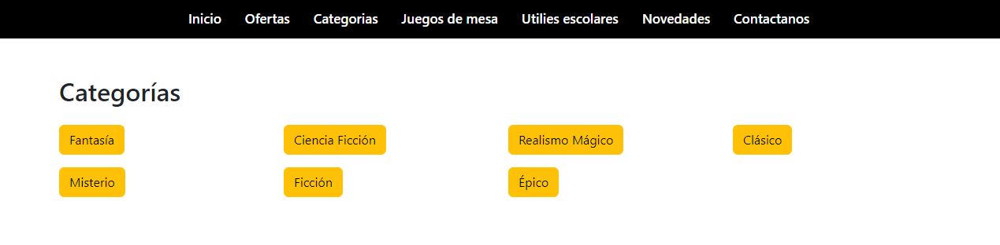
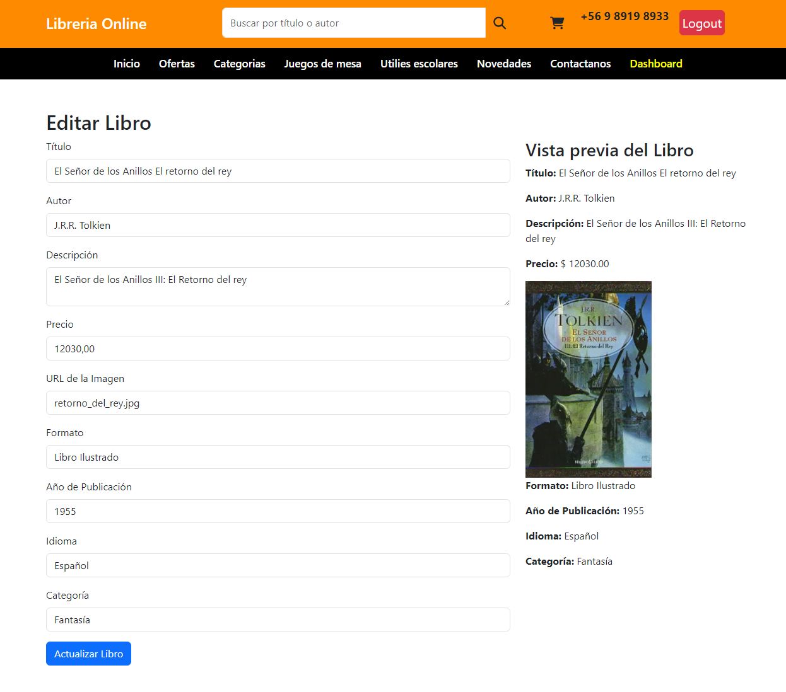
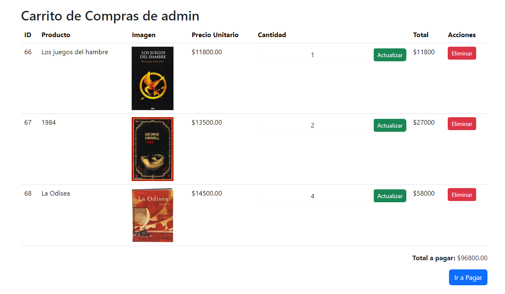

# Librería Online

Librería Online es una aplicación web desarrollada con Bootstrap 5, PHP y MySQL.

## Descripción

Librería Online es una plataforma que permite a los usuarios explorar y comprar libros en línea. La aplicación proporciona funcionalidades como la visualización de libros, la administración de libros (para administradores), y la posibilidad de agregar libros al carrito de compras.

## Tecnologías Utilizadas

- Bootstrap 5
- PHP
- MySQL
- XAMPP

## Características

- Visualización de libros
- Búsqueda de libros por categoría, autor, etc.
- Carrito de compras
- Administración de libros (para administradores)
- Registro de usuarios
- Inicio de sesión seguro con contraseñas hasheadas

## Instalación

1. Clona el repositorio: `git clone https://github.com/tuusuario/libreria-online.git`
2. Configura la base de datos con el script SQL proporcionado.
3. Abre el proyecto en tu servidor local (XAMPP recomendado).

## Uso

1. Accede a la aplicación desde tu navegador.
2. Explora la colección de libros.
3. Regístrate e inicia sesión para acceder a funciones adicionales.
4. Administra libros si tienes un rol de administrador.
5. Agrega libros al carrito y realiza compras.

## Capturas de Pantalla

1. **Página Principal**
   

2. **Visualización de Libro**
   

3. **Búsqueda de Libros**
   

4. **Categorías de Libros**
   

5. **Tablero de Administrador**
   

6. **Edición de Libro (Administrador)**
   

7. **Carrito de Compras**
   

8. **Proceso de Compra**
   

Estas capturas de pantalla proporcionan una vista previa de las características clave de la aplicación.
